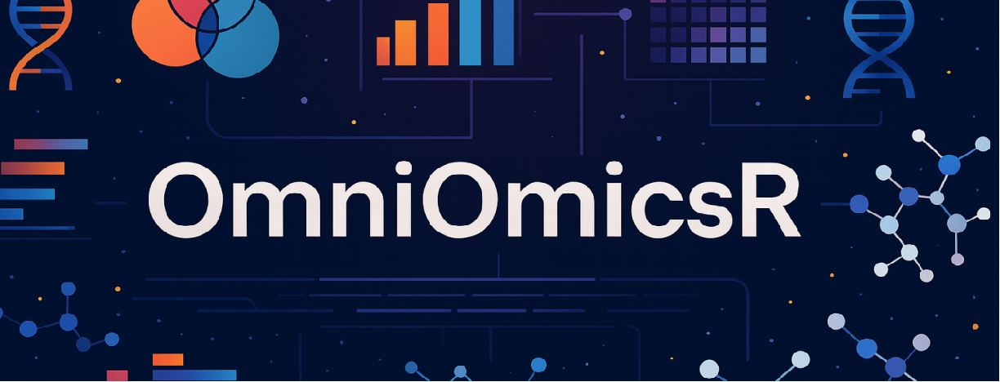

# OmniOmicsR: A Unified, Scalable, and Generative Framework for Next-Generation Multi-Omics and Clinical Integration

<div align="center" style="padding:20px 0;">
  
</div>


<div align="center">

[](https://www.r-project.org/)
[](LICENSE)
[](https://www.bioconductor.org/)
[](DESCRIPTION)

</div>

---

## 📋 Overview

**OmniOmicsR** is a comprehensive R package for end-to-end multi-omics analysis—integrating machine learning, spatial omics, single-cell, and clinical outcomes in one unified framework.

<div align="center">

| 🧬 Multi-Omics Integration | 🤖 Machine Learning & Deep Learning | 📊 Bayesian & Statistical Modeling |
|---------------------------|------------------------------------|-----------------------------------|
| 🗺️ Spatial Transcriptomics | 🔬 Single-Cell Multi-Omics | 🏥 Clinical Outcome Modeling |

</div>


---

## ✨ Key Features

<table>
<tr>
<td style="vertical-align:top; padding:15px; width:50%; border-right:1px solid #eaeaea;">

### 🧬 Multi-Omics
- RNA-seq, proteomics, metabolomics  
- DIABLO, MOFA2, RGCCA integration  
- ComBat, MNN, Harmony batch correction  

### 🤖 Machine Learning
- VAE, Random Forest, XGBoost  
- LASSO, Elastic Net, Boruta  
- Automated hyperparameter tuning  

### 📊 Statistical Inference
- Bayesian inference (Stan / JAGS)  
- WGCNA, GENIE3 regulatory networks  
- edgeR, DESeq2, limma pipelines  

</td>

<td style="vertical-align:top; padding:15px; width:50%;">

### 🗺️ Spatial & Single-Cell
- Spatial transcriptomics (Moran’s I, Geary’s C)  
- CITE-seq, scATAC-seq, multiome  
- Trajectory inference & cell communication  

### 🏥 Clinical Integration
- Survival analysis (Cox, KM curves)  
- Biomarker discovery pipelines  
- Patient stratification & risk modeling  

### 🧠 Deep Learning (OmniGraphDiff)
- Graph neural networks (GCN / GAT / GraphSAGE)  
- Graph-VAE & diffusion models  
- Multi-GPU mixed-precision training  

</td>
</tr>
</table>


---

## 🛠️ Installation

```r
# Install dependencies
if (!requireNamespace("BiocManager", quietly = TRUE))
  install.packages("BiocManager")

BiocManager::install(c("SummarizedExperiment", "MultiAssayExperiment"))

# Install OmniOmicsR
devtools::install_github("dxpython/OmniOmicsR", dependencies = TRUE)
```

**Requirements:** R ≥ 4.3.0 • 8GB+ RAM • Linux/macOS/Windows (WSL2)

<details>
<summary><b>Optional enhancement packages</b></summary>

```r
# Differential expression
BiocManager::install(c("edgeR", "DESeq2", "limma", "sva"))

# Multi-omics integration
BiocManager::install(c("mixOmics", "MOFA2", "RGCCA"))

# Machine learning
install.packages(c("ranger", "xgboost", "glmnet", "Boruta"))

# Network & spatial
BiocManager::install(c("WGCNA", "Seurat", "spatstat"))

# Clinical & Bayesian
install.packages(c("survival", "survminer", "rstan"))
```
</details>

---

## ⚡ Quick Start

```r
library(OmniOmicsR)

# Basic workflow
rna_data <- read_omics_matrix("counts.csv", omics_type = "rna") |>
  qc_basic() |> normalize_tmm() |> normalize_vst()

plot_pca(rna_data, color_by = "group")
dea_results <- dea_deseq2(rna_data, design = ~group)

# Multi-omics integration
omics_list <- list(RNA = rna_data, Protein = protein_data)
integration <- integrate_diablo(omics_list, outcome = outcome, ncomp = 3)

# Clinical analysis
clinical_project <- create_clinical_project(
  omics_assays = omics_list,
  clinical_data = clinical_df,
  survival_data = survival_df
)
survival_result <- clinical_survival(clinical_project)
biomarkers <- clinical_biomarkers(clinical_project, outcome = stage)
```

<details>
<summary><b>Deep Learning with OmniGraphDiff</b></summary>

```r
library(reticulate)
use_virtualenv("~/omnigraphdiff_env")

ogd <- import("omnigraphdiff")
model <- ogd$train$train_model(config_path = "config.yaml")
embeddings <- model$encode(list(rna = rna_mat, protein = protein_mat))
```

See [omnigraphdiff/README.md](omnigraphdiff/README.md) for details.
</details>

---

## 📚 Documentation

| Category | Resources |
|----------|-----------|
| **Getting Started** | [Tutorial](vignettes/getting_started.qmd) • [Architecture](ARCHITECTURE.md) • [Multi-Omics Guide](vignettes/multiomics_integration.qmd) |
| **Deep Learning** | [OmniGraphDiff README](omnigraphdiff/README.md) • [Model Design](omnigraphdiff/MODEL_DESIGN.md) • [Architecture](omnigraphdiff/ARCHITECTURE.md) |
| **Reference** | `?OmniOmicsR` • `?OmicsExperiment` • `?train_vae` • `?clinical_survival` |

---

## Package Structure

```
OmniOmicsR/
├── R/                          # R source code
│   ├── 01-classes.R            # S4 class definitions
│   ├── utils-*.R               # Utility functions
│   ├── io-*.R                  # Data I/O
│   ├── qc-*.R                  # Quality control
│   ├── preprocess-*.R          # Normalization & batch correction
│   ├── stats-*.R               # Statistical methods
│   ├── ml-*.R                  # Machine learning
│   ├── spatial-*.R             # Spatial omics
│   ├── sc-*.R                  # Single-cell multi-omics
│   ├── clinical-*.R            # Clinical integration
│   ├── viz-*.R                 # Visualization
│   ├── simulation-*.R          # Data simulation
│   └── benchmark-*.R           # Benchmarking
├── src/                        # C++ source (Rcpp)
│   └── utils.cpp               # Fast matrix operations
├── inst/                       # Installed files
│   ├── extdata/                # Example datasets
│   ├── scripts/                # Demo scripts
│   └── templates/              # Report templates
├── tests/                      # Test suite
│   └── testthat/
├── vignettes/                  # Tutorials
├── omnigraphdiff/              # Deep learning module (PyTorch)
│   ├── omnigraphdiff/          # Python package
│   │   ├── models/             # GNN, VAE, Diffusion models
│   │   ├── training/           # Trainer, callbacks, DDP
│   │   ├── data/               # DataLoaders, HDF5/NPZ
│   │   ├── losses/             # Multi-objective loss functions
│   │   ├── graphs/             # Graph construction & ops
│   │   └── utils/              # Config, logging, metrics
│   ├── cpp_backend/            # C++ sparse graph operations
│   ├── R/                      # R interface via reticulate
│   ├── examples/               # Training demos & configs
│   ├── tests/                  # Python unit tests
│   ├── MODEL_DESIGN.md         # Mathematical formulation
│   ├── ARCHITECTURE.md         # System design
│   └── README.md               # Complete documentation
└── DESCRIPTION                 # Package metadata
```

---

## 🚀 Performance

**Benchmarks**:

| Operation | Time | Memory |
|-----------|------|--------|
| TMM normalization | <1s | ~800MB |
| VAE training (10 epochs) | ~23s | ~1.2GB |
| Random Forest | ~15s | ~1.5GB |
| Multi-omics integration | ~40s | ~2.5GB |

```r
# Run tests
devtools::test()

# Benchmark
benchmark_results <- benchmark_all(n_features = 10000, n_samples = 1000)
```

---

## 🤝 Contributing

We welcome contributions! See [CONTRIBUTING.md](CONTRIBUTING.md) for guidelines.

```bash
# Clone and setup
git clone https://github.com/dxpython/OmniOmicsR.git
cd OmniOmicsR
git checkout -b feature/your-feature

# Test and check
R -e "devtools::test()"
R -e "devtools::check()"

# Submit pull request
git add .
git commit -m "Add: your feature description"
git push origin feature/your-feature
```
---

## Acknowledgments

### Technical Foundations

This package integrates and extends numerous excellent tools:

- **Bioconductor Core:** SummarizedExperiment, MultiAssayExperiment, S4Vectors
- **Differential Expression:** edgeR, DESeq2, limma
- **Multi-Omics Integration:** mixOmics (DIABLO), MOFA2, RGCCA
- **Machine Learning:** ranger, xgboost, glmnet
- **Deep Learning (OmniGraphDiff):** PyTorch, PyTorch Geometric, pybind11, lifelines
- **Network Analysis:** WGCNA, igraph, GENIE3
- **Spatial Analysis:** Seurat, spatstat, Giotto
- **Statistics:** survival, rstan, metafor

### Personal Acknowledgment

Most importantly, I want to thank Yanyan—the most important person in my life. Her unwavering support, encouragement, and belief in my abilities have been the foundation of every achievement. This project exists because of her strength and dedication. For that, I am deeply grateful.

I am also sincerely thankful for the continuous support and collaboration from friends at **Tsinghua University**, **Shanghai Jiao Tong University**, and **Beijing University of Posts and Telecommunications**. Their insights, discussions, and encouragement have played an invaluable role in shaping the development of this project.

---

## License

MIT License © 2025 Dustin Dong

---

<div align="center">
  
*Built with for the multi-omics research community.Turning data into decisions, algorithms into value.*
